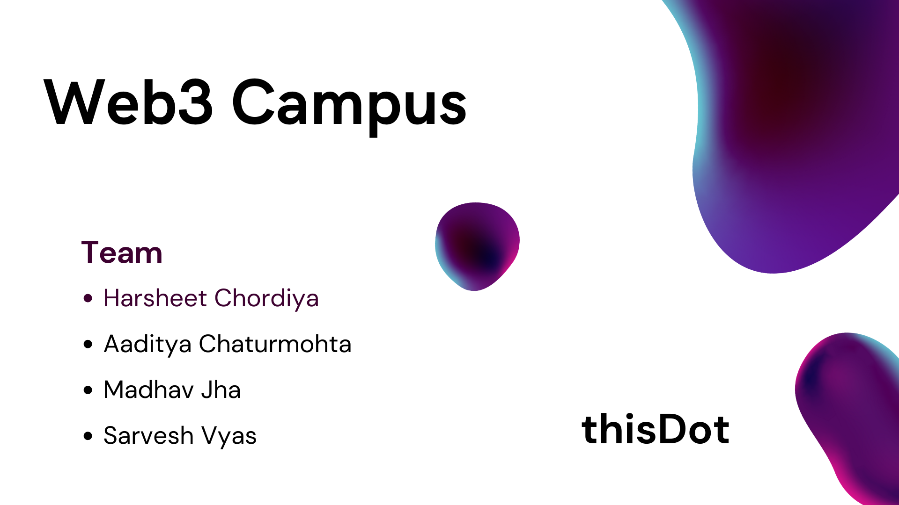
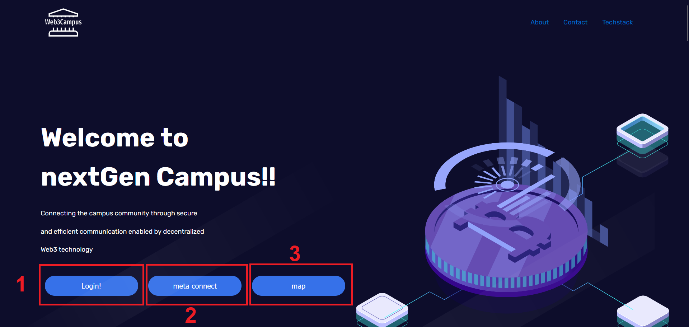

# web3Campus

<a href="https://youtu.be/YQYYK2wRRPM">
  
</a>
Empowering students and faculty with a secure, transparent, and decentralized 'campus formal communication' solution built on Web3 technology.

# Problem Statement
The current state of Web 3 is still in its infancy and there are many challenges to be addressed for it to reach its full potential. These challenges include a lack of user-friendly interfaces, scalability issues, and a lack of adoption among mainstream users.

## Objective
To make an application or system to 
- mass adoption of web3 technology
- more accessible and user-friendly for everyday users

# Our solution: web3Campus
College students are more eager to adapt and try new technologies than any other group and since we want to have mass adoption of web3, they are the best people to include for it.  
An issue that is faced by both students and faculty alike delay in Clearance of  Formal applications (e.g., application for leave, etc).    
Issues could be because of the following:
- misplacement of Applications
- unavailability of concerned person
- delays between follow ups 
- or many other

our approach is to create a decentralized scalable web solution for teachers and students to upload, review and remark the formal applications using.
 
It utilizes the benefits of blockchain to create a platform for transparent and open formal application reviewing. Accompanied with user friendly platform for users to engage with blockchain on a regular basis. 

# Instructions

## One time login
To make onboarding and daily use, we connect students institute mail ID to the crypto wallet using meta mask.

Access our [login page](https://mail-to-address-fireproject.web.app).

  

## 1. Google login

click on the login button to connect your college of any google account

## 2. Crypto wallet login

- install Meta-mask extension for [firefox](https://addons.mozilla.org/en-US/firefox/addon/ether-metamask) or [chrome](https://chrome.google.com/webstore/detail/metamask/nkbihfbeogaeaoehlefnkodbefgpgknn)
- complete the login process for meta-mask

### 2.1 Add Polygon Mumbai Testnet network

We have deployed our smart contract on **Polygon Mumbai testnet Network**.   For you to use it as well you need to add it to your meta-mask extension.  
Follow this [medium blog](https://medium.com/stakingbits/how-to-connect-polygon-mumbai-testnet-to-metamask-fc3487a3871f) to do so.

### 2.2 Get some Matic in your wallet

Currency used for this is **Matic**. so do you need to buy it ?? well no!   
Use the below links to get some Matic in your wallet:
- https://faucet.polygon.technology
- https://mumbaifaucet.com

### 3 Map your google mail to Meta-mask wallet

Click on **Map** button to map your google mail to Meta-mask wallet.  
With this your one time log-in to **web3Campus** is done.

Next you will be redirected the dashboard: https://jhamadhav.com/web3Campus

## Application demo

  
Dashboard

### 1. View Application

  

You can see all the application created in you institute, thus providing a **transparent** system. You can see remarks made by concerned recipients.

### 2. Create Application

  

You can fill all the needed detail and also include any file that you want to attach with it.  
We are using IPFS/Filecoin to store the uploaded file in a decentralized manner.

### 3. Application addressed to you

(same as dashboard)

### 4. add/edit remarks

  
Added recipients can add/edit remarks

# Technologies

## Polygon
We have used Polygon to deploy our smart contract on **Polygon Mumbai Testnet**.

## Filecoin/IPFS
We have used Filecoin's Web3.Storage to store files on decentralized storage network!

## Firebase
We have used firebase to host and add google login to our login page

## Replit
We have used replit to deploy our ipfs filecoin based web3.storage service.

link for the published repl: https://replit.com/@Harsheet196/filecoinupload?v=1

## Truffle Suite
To develop and test application on local machine.

# Event detail

We made and presented this project in <b>[Technex'23 hackathon](https://technex-hackathon.svpcet.in) by  St. Vincent Pallotti College of Engineering & Technology, Nagpur</b> a 24 hour hackathon and placed <b>4th</b> in it.

# Team "thisDot":
- Madhav Jha: [@jhamadhav](https://github.com/jhamadhav)
- Harsheet Chordiya: [@Harsheet196](https://github.com/Harsheet196)
- Sarvesh Vyas: [@git-svyas](https://github.com/git-svyas)
- Aaditya Chaturmohta: [@aadi-byte](https://github.com/aadi-byte)

# Credit
- Log-in page template: https://github.com/canumay/crappo 
- Message toast: https://apvarun.github.io/toastify-js
- Loading window: [BlockChain Animation by Ramona](https://codepen.io/codesofra/pen/XxRwQQ)

